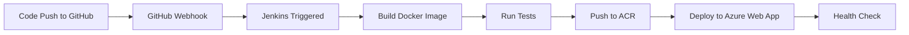

# Jenkins CI/CD Setup Guide

## 🚀 Overview
This document describes the Jenkins CI/CD setup for the VR Campus Viewer project.

## 📋 Infrastructure Components

### Existing Resources (Already Deployed)
1. **Resource Group**: `rg-vr-campus-viewer-dev`
2. **Container Registry (ACR)**: `acrvrcampusviewerdev.azurecr.io`
3. **App Service Plan**: `asp-vr-campus-viewer-dev` (B1 Linux)
4. **Web App**: `app-vr-campus-viewer-dev`
   - URL: https://app-vr-campus-viewer-dev.azurewebsites.net

### New Jenkins Infrastructure (Being Deployed)
5. **Virtual Network**: `vnet-jenkins-dev` (10.0.0.0/16)
6. **Subnet**: `subnet-jenkins` (10.0.1.0/24)
7. **Public IP**: `pip-jenkins-dev` (Static)
8. **Network Security Group**: `nsg-jenkins-dev`
   - SSH (Port 22)
   - Jenkins Web UI (Port 8080)
   - HTTPS (Port 443)
9. **Network Interface**: `nic-jenkins-dev`
10. **Linux VM**: `vm-jenkins-dev`
    - Size: Standard_B2s (2 vCPUs, 4 GB RAM)
    - OS: Ubuntu 22.04 LTS
    - Pre-installed: Jenkins, Docker, Azure CLI

## 💰 Cost Breakdown

| Resource | SKU | Monthly Cost (Est.) |
|----------|-----|---------------------|
| Container Registry | Basic | $5 |
| App Service Plan | B1 (Linux) | $13.14 |
| Jenkins VM | Standard_B2s | $30.37 |
| Public IP | Static | $3.65 |
| **Total** | | **~$52/month** |

> **Note**: With existing app ($19/month), Jenkins adds ~$33/month

## 🔧 Installation Process

### 1. Provider Registration
```powershell
az provider register --namespace Microsoft.Network
```

**Current Status**: Waiting for Microsoft.Network provider registration to complete (typically takes 2-5 minutes)

### 2. Terraform Deployment
```powershell
terraform apply -auto-approve
```

### 3. Automated Installation Script
The `jenkins-install.sh` script automatically installs:
- Java 17 (required for Jenkins)
- Jenkins (latest stable)
- Docker CE (for building containers)
- Azure CLI (for Azure deployments)

### 4. Initial Configuration
After deployment, Jenkins will be accessible at:
- **URL**: `http://<jenkins-public-ip>:8080`
- **SSH**: `ssh azureuser@<jenkins-public-ip>`
- **Initial Password Location**: `/home/azureuser/jenkins-initial-password.txt`

## 🔐 Jenkins Credentials Setup

### Required Credentials

> **📄 All credential values are stored in `JENKINS_CREDENTIALS.txt` (not tracked in Git)**

Refer to `JENKINS_CREDENTIALS.txt` for:
- Azure Service Principal (subscription ID, tenant ID, client ID, client secret)
- Container Registry credentials (login server, username, password)
- Deployment targets (resource group, web app name)

### Adding Credentials in Jenkins UI
1. Navigate to **Manage Jenkins** → **Manage Credentials**
2. Click on **(global)** domain
3. Add the following credentials:

#### Azure Service Principal
- **Kind**: Secret text
- **Scope**: Global
- **ID**: `azure-service-principal`
- **Secret**: Get JSON format from `JENKINS_CREDENTIALS.txt`

#### ACR Credentials
- **Kind**: Username with password
- **ID**: `acr-credentials`
- **Username**: Get from `JENKINS_CREDENTIALS.txt`
- **Password**: Get from `JENKINS_CREDENTIALS.txt`

#### Individual Secrets
Add these as **Secret text** credentials:
- `acr-login-server`: `acrvrcampusviewerdev.azurecr.io`
- `azure-resource-group`: `rg-vr-campus-viewer-dev`
- `azure-webapp-name`: `app-vr-campus-viewer-dev`

## 🔄 CI/CD Pipeline Flow



### Pipeline Stages
1. **Checkout**: Pull code from GitHub
2. **Verify Prerequisites**: Check required files exist
3. **Build Docker Image**: Build with `BUILD_NUMBER` tag
4. **Test Docker Image**: Run container on port 8888, verify
5. **Push to ACR**: Upload image to Azure Container Registry
6. **Deploy to Azure**: Update Web App with new image
7. **Health Check**: Wait 30s, verify deployment

## 🔗 GitHub Integration

### Webhook Setup
1. Go to your GitHub repository: `https://github.com/CodesbyBalaji/Devops_project`
2. Navigate to **Settings** → **Webhooks** → **Add webhook**
3. Configure:
   - **Payload URL**: `http://<jenkins-public-ip>:8080/github-webhook/`
   - **Content type**: `application/json`
   - **Events**: Select "Just the push event"
   - **Active**: ✓
4. Click **Add webhook**

### Jenkins Project Setup
1. Create **New Item** → **Pipeline**
2. Name it `vr-campus-viewer-pipeline`
3. Configure:
   - **GitHub project**: `https://github.com/CodesbyBalaji/Devops_project`
   - **Build Triggers**: ✓ GitHub hook trigger for GITScm polling
   - **Pipeline**: 
     - **Definition**: Pipeline script from SCM
     - **SCM**: Git
     - **Repository URL**: `https://github.com/CodesbyBalaji/Devops_project.git`
     - **Branch**: `*/main`
     - **Script Path**: `Jenkinsfile`
4. Save

## 🧪 Testing the Pipeline

### Manual Test
1. Go to Jenkins dashboard
2. Click on `vr-campus-viewer-pipeline`
3. Click **Build Now**
4. Watch the console output

### Automatic Test
1. Make a small change to `index.html`
2. Commit and push:
```powershell
git add index.html
git commit -m "test: Trigger Jenkins pipeline"
git push origin main
```
3. Jenkins should automatically start building

## 📊 Monitoring & Logs

### Jenkins Logs
- **Web UI**: `http://<jenkins-public-ip>:8080/log/all`
- **SSH**: `ssh azureuser@<jenkins-public-ip>`, then `sudo journalctl -u jenkins -f`

### Application Logs
```powershell
# Azure CLI
az webapp log tail --name app-vr-campus-viewer-dev --resource-group rg-vr-campus-viewer-dev

# Or via Azure Portal
# https://portal.azure.com → App Services → app-vr-campus-viewer-dev → Log stream
```

## 🔒 Security Best Practices

1. **SSH Key Management**
   - Private key stored at: `C:\Users\Development\.ssh\jenkins_azure_key`
   - Never commit private key to Git
   - Keep passphrase secure if using one

2. **Credential Rotation**
   - Service Principal secrets expire after 1 year
   - ACR passwords can be regenerated in Azure Portal
   - Update Jenkins credentials after rotation

3. **Network Security**
   - NSG restricts incoming traffic to SSH (22), Jenkins (8080), HTTPS (443)
   - Consider restricting SSH to specific IP addresses
   - Use HTTPS for Jenkins (requires certificate setup)

4. **Jenkins Security**
   - Enable CSRF protection (enabled by default)
   - Install security updates regularly
   - Use role-based access control for team members

## 🛠️ Troubleshooting

### Jenkins VM Not Accessible
```powershell
# Check VM status
az vm get-instance-view --name vm-jenkins-dev --resource-group rg-vr-campus-viewer-dev --query "instanceView.statuses[?starts_with(code, 'PowerState/')].displayStatus" -o tsv

# Start VM if stopped
az vm start --name vm-jenkins-dev --resource-group rg-vr-campus-viewer-dev
```

### Jenkins Service Not Running
```bash
# SSH into VM
ssh azureuser@<jenkins-public-ip>

# Check Jenkins status
sudo systemctl status jenkins

# Restart Jenkins
sudo systemctl restart jenkins

# View logs
sudo journalctl -u jenkins -n 100
```

### Pipeline Failing
1. Check Jenkins console output for errors
2. Verify credentials are correctly configured
3. Test Docker/Azure CLI commands manually on Jenkins VM
4. Check Azure Web App deployment logs

### Can't Push to ACR
```bash
# SSH into Jenkins VM
ssh azureuser@<jenkins-public-ip>

# Test ACR login (Get credentials from JENKINS_CREDENTIALS.txt)
docker login <ACR_LOGIN_SERVER> -u <ACR_USERNAME> -p "<ACR_PASSWORD>"

# Try manual push
docker tag vr-campus-viewer:test <ACR_LOGIN_SERVER>/vr-campus-viewer:test
docker push <ACR_LOGIN_SERVER>/vr-campus-viewer:test
```

## 📚 Next Steps

1. ✅ Wait for Microsoft.Network provider registration
2. ⏳ Complete Terraform deployment
3. ⏳ Access Jenkins UI and complete setup wizard
4. ⏳ Install recommended plugins
5. ⏳ Configure credentials
6. ⏳ Create pipeline project
7. ⏳ Set up GitHub webhook
8. ⏳ Test first automated deployment

## 📞 Support

- **Azure Documentation**: https://docs.microsoft.com/azure
- **Jenkins Documentation**: https://www.jenkins.io/doc/
- **Terraform Azure Provider**: https://registry.terraform.io/providers/hashicorp/azurerm/latest/docs

---

**Last Updated**: October 29, 2025
**Project**: VR Campus Viewer
**Environment**: Development (East Asia region)
